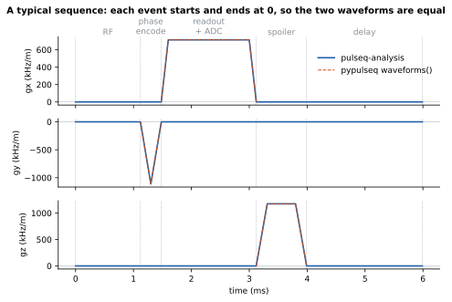
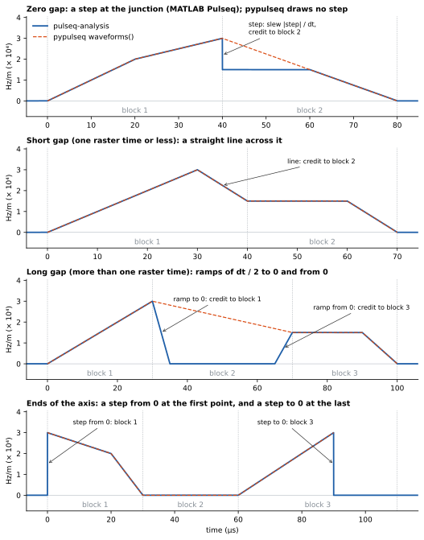
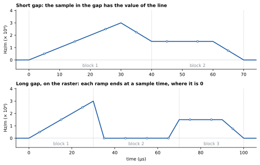

# How pulseq-analysis works

[`docs/usage.md`](usage.md) is the guide: it shows how to use the package for
its main tasks. This document gives the exact definitions behind its values,
the rules for the rare cases, and the algorithms and their cost. Read it when
you need to know exactly what a value is, why it differs from pypulseq, or how
long a call takes. (`docs/plans/implementation.md` is the plan of the first
version of the package, not this document.)

The names that the two documents give are the interface of the package. A
name that they do not give, or that starts with `_`, can change in any
release.

Contents:

1. [The gradient waveform](#1-the-gradient-waveform)
2. [The measurements in detail](#2-the-measurements-in-detail)
3. [Algorithms and cost](#3-algorithms-and-cost)
4. [Kept results](#4-kept-results)
5. [The result objects](#5-the-result-objects)
6. [Argument checks](#6-argument-checks)
7. [The signature check](#7-the-signature-check)
8. [`Series`: checks and the array encoding](#8-series-checks-and-the-array-encoding)

## 1. The gradient waveform

Each measurement of the gradients uses one waveform for each axis:
`gradient_peaks`, `block_gradient_values`, `pns_levels`, `gradient_spectrum`
and `GradientSampler`. It is the gradient waveform of MATLAB Pulseq
(`waveforms_and_times` in `Sequence.m`). This section gives it.

### 1.1 In practice



In most sequences, each gradient event starts and ends at 0 (a trapezoid, or
an extended trapezoid with ramps), or two events join at the same value at a
block junction (one gradient split across blocks). Then the waveform is the
events joined together, and it is 0 between them. It is the waveform that
pypulseq draws, and you do not need the rest of this section.

The rules of sections 1.3 and 1.4 change a value only when a sequence has one
of these:

- An event that starts or ends at a value that is not 0, next to a time with
  no event on that axis (a gap).
- Two events that join at a block junction with different values (a step).
- A first or a last event of an axis that starts or ends at a value that is
  not 0.

pypulseq's `add_block` accepts each of these only when the value (or the step)
is at most `max_slew * grad_raster_time`: one raster time of the largest slew.
For 150 T/m/s and a raster time of 10 µs, that is 1.5 mT/m (63 864 Hz/m). So
the amplitudes that these rules change are small. But a step of that size is a
slew of up to `max_slew`, so a step can be the largest slew of the file, and
it is part of the PNS. That is why the package uses these rules and does not
use pypulseq's line across each gap.

### 1.2 The events

In this section, `dt` is `seq.grad_raster_time`, the `GradientRasterTime` of
the file. It is not the raster of `seq.system`. `TIME_TOLERANCE` is 1e-9 s
(`seq_utils.TIME_TOLERANCE`).

The waveform of one axis is a polyline. A gradient event gives its points at
the times `(block start + delay) + offset`, with its amplitudes
(`seq_utils.gradient_points`). A trapezoid has its corner points. An extended
trapezoid has its corner points, and an arbitrary gradient has its sample
points. Between two points of one event, the waveform is a straight line.

### 1.3 The gaps



Take two consecutive events of one axis. The blocks between them have no event
on the axis. `last_time` and `last` are the time and the value of the last
point of the earlier event. `first_time` and `first` are the time and the value
of the first point of the later event. The gap is `first_time - last_time`.

| Gap | Rule | Waveform |
|---|---|---|
| Zero gap | The gap is at most `TIME_TOLERANCE`. | No point. When `first` is not `last`, the waveform has a step from `last` to `first` at `first_time`. The value at the time of the step is `last`. |
| Short gap | The gap is more than `TIME_TOLERANCE` and at most `dt + TIME_TOLERANCE`. | No point. The waveform is the straight line from the last point to the first point. |
| Long gap | The gap is more than `dt + TIME_TOLERANCE`. | A ramp to 0 from the last point to the time `last_time + dt / 2`, when `last` is not 0. A ramp from 0 from the time `first_time - dt / 2` to the first point, when `first` is not 0. The value is 0 between the ramps. |

A value of 1e-6 Hz/m or less also gets its ramp. MATLAB Pulseq sets such a
value to 0 and adds no ramp. The difference is at most 1e-6 Hz/m in half a
raster time.

### 1.4 The ends of the axis

The value is 0 before the first point of the axis and after its last point. A
first value that is not 0 is a step from 0 at the first point. A last value
that is not 0 is a step to 0 at the last point (the bottom panel of the figure
above).

### 1.5 The slew

The slew of a segment (a segment of an event, a ramp or a line) is its slope.
The slope of a ramp is `2 * |value| / dt`. The slope of the line across a short
gap is `|first - last| / (first_time - last_time)`. A segment shorter than
`TIME_TOLERANCE` has no slope. The slew of a step is `|step| / dt`. The scanner
plays a step in one raster time, so a step is a slew like a slope. The slew of
an axis is the largest of these values.

### 1.6 The credit of each item to a block

A value, a slew and an RMS integral have the credit of a block (a play index).
The annotations of the figure above show the credit. The credit is:

- The points and the segments of an event: the block of the event.
- A ramp to 0: the block of the earlier event, also when the ramp is after the
  end of that block.
- A ramp from 0: the block of the later event.
- A step across a zero gap and the line across a short gap: the block of the
  later event.
- The step before the first point of the axis: the block of the first event. The
  step after the last point: the block of the last event.

The time of a segment is its start. For a segment that the edge of a range
cuts, it is the start of the cut. The time of a step is its time: `first_time`
for a step across a zero gap, and the time of the point for the step at an end
of the axis. The time of a ramp to 0 is `last_time`, the time of a ramp from 0
is `first_time - dt / 2` and the time of a line is `last_time`. When several
items have the largest value, the first of them in play order gets the credit.
The step or the line into an event is before the segments of that event.

### 1.7 A range

A range is `[lo, hi]` (the whole file, or a window of `gradient_peaks`). A
segment that crosses an edge of the range is cut at the edge. The value at the
edge is found by linear interpolation. A step is in the range when
`lo <= t < hi` and `t < end_s - TIME_TOLERANCE`, with `end_s` the end of the
sequence. So a step at the start of a window is in it, and a step at the end of
a window is not. The step after the last point of the axis is at the time of
that point. When that point is within `TIME_TOLERANCE` of the end of the
sequence, no range has the step: the whole file does not have it. The result
does not depend on whether `(start + delay) + shape_dur` rounds to `end_s` or to
one ulp before it.

### 1.8 The RMS and the vector peak

The RMS integral is the integral of the square of the polyline, with the ramps
and the lines. A step adds nothing.

The vector peak is the largest `sqrt(gx^2 + gy^2 + gz^2)` at the union of the
times of the points of the three axes. The ramp points are points. At a time,
the value is found on both sides of the time, so a step has two values. The
credit goes by the time, not by the axis. The value before the time goes to the
first block that ends at or after the time. The value after the time goes to
the last block that starts at or before the time. Each is within
`TIME_TOLERANCE`. Of equal values, the earliest time wins.

### 1.9 The difference from pypulseq

pypulseq's `Sequence.waveforms()` joins the points of the events of an axis
and does nothing at a gap. `get_gradients()`, `calculate_pns` and
`calculate_gradient_spectrum` use these points. So pypulseq draws a straight
line across each gap, also across a long gap. At a zero gap it drops the first
point of the later event, so it has no step. The dashed lines of the figure
above show it.

The two waveforms are equal when the file has no end that is not 0 next to a
long gap, and no step at a block junction (section 1.1). pypulseq's
`calculate_pns` and `calculate_gradient_spectrum` then give the values of the
package, with the units of [`docs/usage.md`, section 9](usage.md#9-units-and-gamma).

## 2. The measurements in detail

### 2.1 `gradient_peaks` and `block_gradient_values`

The values are the largest values of the waveform of section 1, over the
whole file, over a window, or for each block:

- The peak is the largest absolute amplitude.
- The slew is the largest of the slopes of the segments (of the events, the
  ramps and the lines) and of the steps (section 1.5).
- The RMS is the root of the mean of the square of the waveform over the range.
- The vector peak is the largest magnitude of the three-axis vector
  (section 1.8).

An axis with no event in a block has the amplitude 0 there. When several
blocks have the largest value, the first of them in play order gets the
credit. A largest value of 0 gives no block (`None`) and the time 0.0.

**The slew block.** `AxisResult.slew_time_s` is the start of the segment of
the largest slew (the start of the range when the range cuts the segment), or
the time of that step. `slew_block` is the block of its credit (section 1.6):
the block of the event of the segment; the later block for a step, a line and
a ramp from 0; the earlier block for a ramp to 0; and the block of the last
event for the step after the last point of the axis.

**A window.** `range_s` is the window with each end clipped to `(0.0, end_s)`
of the sequence, so its start is never after its end. A window that is past an
end of the sequence by less than `seq_utils.TIME_TOLERANCE` has the range
`(end_s, end_s)` (or `(0.0, 0.0)`), of length 0, with the `reason`
`seq_index.NO_GRADIENTS_IN_WINDOW` and the zero values. A segment that crosses
an end of the window is cut there, and a step is in the window by the rule of
section 1.7. The `reason` is `None` when the range has a part of a gradient
event, or a ramp, a line or a step with a value that is not 0.

A call with a window uses the values of each block that the sequence object
keeps (the peak, the slew, the junction, the RMS integral and the vector peak,
with their times) for the blocks that are whole in the window. It makes the
other blocks of an edge of the window from the exact waveform. The time range
of a block is the span of the block and of its items on the three axes: its
event, its ramps, the line into it and the step after the last point of the
axis. The line across a short gap starts at the last point of the earlier
event, up to `dt + TIME_TOLERANCE` before the event, and can cross blocks that
are shorter than `dt`. A ramp to 0 ends half a raster time after its event. A
block whose time range an edge of the window crosses is made from the exact
waveform, so an edge is not limited to one or two blocks.

**The values of each block.** In `BlockGradientValues`:

- `slew_hz_per_m_per_s` is the largest slope of a segment of the event of the
  block or of its ramps. The ramp to 0 after the event and the ramp from 0
  before it are in the slew of this block. So is the step after the last point
  of the axis, in the block of the last event, when that point is more than
  `TIME_TOLERANCE` before the end of the sequence.
- `junction_hz_per_m_per_s` is the step into the event of the block across a
  zero gap, `|last - first|` divided by `seq.grad_raster_time`, or the slope of
  the line into it across a short gap, `|last - first|` divided by the gap. It
  is 0 for a long gap, and for a block with no event on the axis. For the first
  event of the axis it is the step from 0. Its time is the time of the first
  point of the event for a step, and the time of the last point of the earlier
  event for a line. There is no field for it.
- A block with no event on an axis has the peak, the slope and the junction 0
  there, at the time `start_s`.
- The vector peak of a block goes by time (section 1.8), so a block with no
  event can have a vector peak that is not 0: the value of a ramp or a line at
  its start or its end.

The largest of each amplitude array is the value of `gradient_peaks` for the
whole file. Its slew is the larger of the largest segment slew and the largest
junction. The first play index of a largest value is the block of that value.
For the vector peak, it is the block with the earliest `vector_peak_time_s` of
the blocks that have the largest value.

### 2.2 `pns_levels`

**The samples.** The model takes one sample of each axis for each gradient
raster time `dt = seq.grad_raster_time`. Sample `k` is at the time
`(k + 0.5) * dt`. The value of a sample is the waveform of section 1 at that
time: a line across a gap of one raster time or less, a ramp to 0 and a ramp
from 0 across a longer gap, and a step at a block junction.



The samples of a block start at the start of that block, so a block gives the
same samples wherever it is in the sequence. Only the samples in a gap use the
sum of the durations of the blocks before them. When every event is on the
edges of the gradient raster, a ramp of half a raster time ends at a time of a
sample, where it is 0. So on the raster, a long gap changes no sample, and a
short gap gives its samples the value of the line.

`PnsLevels.on_raster` is `True` when the duration of each block is a whole
number of samples (`sampling.raster_block_lengths`). Otherwise the samples come
from the waveform of the whole file at the same times (`GradientSampler.sample`).

**The model.** The SAFE model of the pinned pypulseq fork runs on the Hz/m
samples, and reads no gamma. The value of an axis is the output of the model
for that axis, and the total of a sample is `sqrt(x^2 + y^2 + z^2)` of the
three values. A PNS value is in Hz/T: the fraction of the stimulation limit
times |γ|. pypulseq's `seq.calculate_pns` divides by `seq.system.gamma`, so it
gives fractions. `pns_levels` equals it, times |γ|, for a sequence where the
two waveforms are equal (section 1.9).

**The peak.** `peak_time_s` is the time of the first sample whose total is
within `pns_levels.PEAK_TOLERANCE` (a fraction) of the peak. It is `None` when
the peak is 0: with `NO_GRADIENTS`, and for gradients that all have the
amplitude 0 (then the model does not run a second time to find the time).

**The runs above a threshold.** `above[t]` has each run of consecutive samples
whose float64 total is at or above `t`, in time order. A run starts at
`first * dt` and ends at `(last + 1) * dt`, the edges of its samples, so a run
of one sample has `end_s - start_s == dt`. A tuple is empty when
`peak_hz_per_t` is below its threshold. Otherwise its largest
`PnsInterval.peak_hz_per_t` is `peak_hz_per_t`. All thresholds are found in
one pass.

**The bins of the level.** `bin_samples_for(num_samples, dt, bin_s)` gives the
whole number of samples of a bin. When `bin_s / dt` is within
`ON_RASTER_TOLERANCE` (1e-6) of a whole number, that is the number, so
`bin_s=0.01` gives 1000 samples at the 10 µs raster. Else it is the number
rounded down: `bin_s=10.0 / 1624` gives 615 samples. The bin has at least one
sample, so a `bin_s` shorter than `dt` gives bins of one sample. When the level
would have more than `pns_levels.MAX_BINS` (2,000,000) bins, the bins are
longer, so that the level has at most that many. Only the level depends on
`bin_s`: the summary and the intervals do not. The bin of a result is
`bin_samples * dt_s`. Each total of a bin is in
`[level_min_hz_per_t, level_max_hz_per_t]` of the bin, and the last bin can
have fewer samples.

**The hardware.** `pns_levels.SAFE_FIELDS` is the nine fields of each axis of
a SAFE hardware struct, in the order of `safe_example_hw` and `asc_to_hw`.
Section 6 gives the checks of the struct. Two pairs of one `.asc` file,
whatever the spelling of its path, have the same label and values, so
`pns_levels` keeps one result for them.

### 2.3 `gradient_spectrum`

The waveform of section 1 is sampled with `GradientSampler.sample`. The method
is that of pypulseq's `calculate_gradient_spectrum`:

- Each window is a Hann window of `window_s` (50 ms by default), and the
  windows overlap by 50 % (`nwin // 2`). The mean of each window is removed.
  The spectrum of a window is the magnitude of its FFT of length
  `nfft = round(frequency_oversampling * nwin)`, scaled as an amplitude
  spectral density: thus the unit has √Hz.
- The gradients are sampled to the end of the sequence
  (`sampling.sequence_samples` gives the number of samples). The sampled
  waveform has half a window of zeros at the start. At the end it has half a
  window or more: the fewest zeros that make the padded waveform one window
  plus a whole number of hops long. (A hop is the step between two windows,
  25 ms by default.) Thus each sample, the last one too, is within half a hop
  of the centre of some window, and a gradient at the end of the sequence is
  attenuated by the window no more than one in the middle.
- In each window, the three axes combine as the RSS (the root of the sum of
  squares). The spectrum of an axis is its maximum over the windows. The RSS
  spectrum is the maximum over the windows of the RSS.
- The windows go through the FFT in chunks of 256 windows, so the memory does
  not grow with the length of the sequence.

These arguments of pypulseq are not arguments here:

- The overlap. pypulseq has no argument for it. It stays 50 %.
- `combine_mode` and `use_derivative`. They change what a value is, for
  example a spectrum of the slew rate. A later quantity gets its own function.
- `time_range`. The spectrum is of the whole sequence, as `gradient_peaks`
  without `window`.
- `acoustic_resonances`. The resonances are data of a target, not of a
  sequence.

### 2.4 The sampler and the number of samples

`GradientSampler.sample(axis, t)` gives the values at the sorted times `t`.
They are the straight lines between the points of all the events of the axis,
with the ramps to 0 and from 0 across a long gap, and 0 before the first point
and after the last point. The value at the time of a step is the value before
the step.

`GradientSampler.block_samples(axis, first, stop, dt, *, skip=0, count=None)`
gives the samples of the play indexes `first` to `stop - 1`, each block on its
own at the times `(j + 0.5) * dt` from its start, with the values of its own
event and 0 outside it. A sample in a gap has the value of the waveform there:
the line across a short gap, or the ramp of a long gap. This holds in any
block, also in a block with no event on the axis. The time of a sample in a gap
is `start + (j + 0.5) * dt`, with `start` the sum of the durations of the
blocks before the block, so it has the float drift of that sum. The own-event
samples have none. This is what the PNS model uses. `skip` and `count` (0 or
more) choose a part of that range: the result is, bit for bit, the samples
`skip` to `skip + count - 1` of the result for the default arguments, and
`count=None` gives all the samples after `skip`. The first and the last block
give only their samples inside the part, so the cost and the memory do not
grow with the length of a block that the part cuts. It raises `ValueError`
when a block of the range is not a whole number of samples long, or when
`skip` or `count` is negative or `skip + count` is more than the samples of
the range.

`sampling.raster_block_lengths(index, dt)` gives the number of samples of each
block, `round(duration / dt)`, and one bool for all the blocks: whether every
block is within `sampling.ON_RASTER_TOLERANCE` samples of a whole number.

`sampling.sequence_samples(index, dt)` gives the number of samples of the
whole sequence, as an `int`. `pns_levels` and `grad_spectrum` both use it.
When every block is on the raster, it is the sum of the block lengths.
Otherwise it is `ceil((index.end_s - 1e-10) / dt)`, and at least 0.

### 2.5 The block table

`sequence_index` reads `seq.block_events` and `seq.block_durations`, with no
`get_block`. It numbers the unique events of each kind from 1, in the order of
their first use: block by block in play order, and in one block in the order
gx, gy, gz. The three gradient axes share one number space, so one event that
plays on x and on y has one number. The event columns use the smallest of
uint8, uint16 and uint32 that holds the number of unique events.

`rf_events`, `grad_events` and `adc_events` read one block with `get_block`
for each unique event, not for each block, with pypulseq's block cache off.
`block_cache_off(seq)` is the context manager that they use: pypulseq keeps
each block that `get_block` reads when `seq.use_block_cache` is true, and
nothing removes it.

## 3. Algorithms and cost

This section gives the algorithm of each call, its cost, and measured times.
Use it to know how long a call takes on a large sequence, and what makes it
slow.

### 3.1 Notation

| Symbol | Meaning |
|---|---|
| B | The number of blocks. |
| K | The number of unique gradient events (`index.grad_first.size`). |
| P | The number of points of the unique gradient events. |
| P_play | The number of points of all the gradient events that play: the sum, over the blocks, of the points of the events of the block. |
| U | The number of unique pairs (gradient event, block length in samples) of the blocks that play. |
| S | The number of samples on the gradient raster: the duration divided by `dt`. A sequence of 2 minutes at 10 µs has 12 million. |
| Q | The number of times of a call of `sample`. |
| nwin, nfft | The samples of a window of the spectrum, and the length of its FFT. |

The time of a call grows with one of three sizes: the number of blocks (B,
P_play), the number of unique events (K), or the duration (S). A sequence that
repeats a TR has few unique events, so K is small for it. A sequence with a
new gradient in each TR (for example a phase-encode table with no repeat) has a
K that grows with B.

### 3.2 The shared work

Each gradient measurement starts from some of the same parts. The package makes
each part one time for each sequence object and keeps it (section 4), so only
the first measurement that needs a part pays for it.

- **The block table** (`sequence_index`). A Python loop over
  `seq.block_events` and `seq.block_durations`, then numpy: a cumulative sum
  for the starts, and a lookup table that numbers the events in the order of
  their first use. It calls no `get_block`. Time O(B), memory O(B).
- **The points of the unique gradient events.** One `get_block` and one
  `seq_utils.gradient_offsets` for each unique gradient event, in a Python
  loop. The points go into flat arrays for all the events, and all the
  measurements share them. Time O(K) calls of pypulseq, plus O(P). This is a
  part whose cost grows with K: about 7 µs for each unique event (section 3.5).
  The first call of `gradient_peaks` also makes the values of each unique event
  (`_event_values`), a Python loop over the K events that takes about 13 µs for
  each of them. So that first call grows by about 19 µs for each unique event
  in all.
- **The gaps of each axis.** The consecutive events of an axis, the length of
  each gap between them, and its kind (section 1.3). Vectorised. Time
  O(M log M) for the M blocks with an event on the axis. Only `GradientSampler`
  uses these gaps, and so only `pns_levels`, `gradient_spectrum` and
  `gradient_sampler` share them. `gradient_peaks` and `block_gradient_values`
  do not: they classify the gaps of each axis themselves, with the values of
  each block, in a vectorised step of their first call.

### 3.3 Each call

**`gradient_peaks(seq)` and `block_gradient_values(seq)`.** The first call
makes the values of each block, and keeps them for the two functions and for
all windows:

1. The peak, the slew and the RMS integral of each unique event, from its
   points. A Python loop over the K events, with small numpy operations: about
   13 µs for each event.
2. The values of each block: the values of its event on each axis, by index
   into the values of step 1, with the ramps, the lines and the steps of the
   gaps. Vectorised. Time O(B).
3. The exact vector peak. The polyline of each axis over the whole file, from
   the points of all the events that play, and the sorted union of the times of
   the points of the three axes. Time O(P_play log P_play). For a sequence with
   few unique events, this step is the largest part of the first call.
4. The result of the whole file: the first largest value of each array.

`block_gradient_values` then copies the arrays of the blocks, in time O(B).
Time of the first call O(K + B + P_play log P_play), memory O(B + P_play).

**`gradient_peaks(seq, window=...)`.** A binary search finds the blocks of the
window in the kept arrays. The blocks that are whole in the window give their
kept values (a vectorised largest value and sum over them). The blocks whose
time range an edge of the window crosses (section 2.1) are made from the exact
polyline of their events. Time O(log B + blocks in the window), with no term
for K or for the blocks of the file. The work at the edges is most of the
time: a window of 5000 blocks takes about the time of a window of one TR.

**`GradientSampler.sample(axis, t)`.** A binary search finds the blocks from
`t[0]` to `t[-1]`. The points of their events, with the ramps of the long gaps,
make the polyline of that range, and `np.interp` gives the values. Time
O(log B + points of the events in the range + Q), memory O(Q + those points).
This leaves out two costs of the first call. `gradient_sampler(seq)` makes a
new sampler for each call, and the first `sample` of a sampler on an axis scans
all B blocks for the blocks with an event on that axis (`_event_blocks`, time
O(B), kept by the sampler). The first sampler of a sequence also finds the gaps
of that axis (section 3.2).

**`GradientSampler.block_samples(...)`.** The samples of each block of a
range, on the raster. The samples of one event in a block of one length are
the same in each block, so the sampler makes them one time for each unique
pair (event, block length) and copies them into each block. The samples of the
gaps are then written over them, vectorised. Time O(samples of the range),
plus O(pairs × blocks of the range) to find the blocks of each pair, plus the
samples of each new pair one time. A sequence that repeats a TR has few pairs.

**`pns_levels`.** The model runs on chunks of about 30,000 samples, or of one
bin when a bin is longer (a chunk is `bin_samples * ceil(CHUNK_SAMPLES /
bin_samples)` samples, so a `bin_s` of 2 s gives chunks of 200,000 samples). The
memory does not grow with the duration:

1. `block_samples` gives the samples of the chunk on each axis. A sequence
   that is not on the raster uses `sample` instead.
2. The SAFE model: for each axis, the slew (the difference of the samples)
   goes through three first-order recursive filters (`scipy.signal.lfilter`),
   with the state of the filters carried from the chunk before.
3. The total of each sample, the least and the greatest total of each bin,
   and the runs at or above each threshold.

After the last chunk, the model runs again on the one chunk of the peak, to
find the time of the peak. Time O(S), plus O(S) for each threshold (a
comparison, which adds a few percent), plus O(U) for the samples of the unique
pairs (event, block length) that `block_samples` makes one time for each pair
(section 2.4). Memory O(chunk) for the samples (at the default `bin_s`, about
6 MB; 34 MB for a `bin_s` of 2 s), plus the bins (at most `MAX_BINS`, 16 MB), the
runs, and the cache of `block_samples`, which holds the samples of each unique
pair up to the last point of its event, 8 bytes for each sample: 16 MB for 1000
different arbitrary gradients of 2000 samples.

The cost grows with the duration, not with the number of blocks, when the
sequence has few unique events: one block of 120 s took 0.83 s, and 1200 blocks
of 0.1 s (12 million samples in each case) took 0.86 s. A sequence with many
unique events pays for each of them, about 20 µs for each one (section 3.5).

**`gradient_spectrum`.** The windows go through the FFT in chunks of 256
windows:

1. `sample` gives the samples of the windows of the chunk on each axis, at the
   raster times.
2. A strided view gives the windows, with no copy. The mean of each window is
   removed, and the Hann window is applied.
3. `np.fft.rfft` of length nfft. Only the frequencies up to
   `max_frequency_hz` are kept.
4. The running maximum over the windows, for each axis and for the RSS.

There are about `2 * S / nwin` windows, so the time is
O(S · frequency_oversampling · log nfft): the FFT is most of it. Memory
O(256 · nfft) for one chunk: about 54 MB with the default arguments at the
10 µs raster. The spectrum samples each chunk one time, and the windows are a
view of those samples with no copy. Only the overlap of two chunks, one window
less one hop (half a window) for each 256 windows, is sampled twice.

**The other calls.** `Series` checks, `to_obj`, `from_obj`, `encode_array` and
`decode_array` take time O(n) for n values. `asc.read_gradient_asc` takes time
O(the size of the file and of its included files). `extensions.refuse_rotations`
and `refuse_unsigned` take time O(1). `analyses.registry()` reads the entry
points of the installed packages. An analysis `compute` is its function.

### 3.4 Summary

| Call | Time | Memory | Grows most with |
|---|---|---|---|
| `sequence_index` | O(B) | O(B) | blocks |
| First gradient measurement (the points of the unique events) | O(K) `get_block` | O(P) | unique events |
| `gradient_peaks(seq)`, `block_gradient_values` | O(K + B + P_play log P_play) | O(B + P_play) | blocks |
| `gradient_peaks(seq, window=...)` | O(log B + blocks in the window) | O(blocks in the window) | (almost constant) |
| `GradientSampler.sample` | O(log B + points in the range + Q); the first call on an axis of a new sampler also O(B) | O(Q + points in the range) | times asked |
| `pns_levels` | O(S + U) | O(chunk + bins + samples of the U pairs) | duration, and unique events |
| `gradient_spectrum` | O(S · oversampling · log nfft) | O(256 · nfft) | duration |

### 3.5 Measured times

These times are from an Apple M1 Max, on 2026-10-07, with Python 3.12.14,
numpy 2.5.3 and the pinned pypulseq 1.5.0.post1, at commit `67ec640`. The
sequences are those of `tests/scale_sequences.py`: a GRE TR of 5 blocks
(6 ms), with a phase-encode table of 256 entries (`build_repeating`) or with a
new phase-encode event in each TR (`build_worst`).

| Call | 100,000 blocks, 120 s, K = 258 | 100,000 blocks, 140 s, K = 20,002 | 1,000,000 blocks, 1198 s, K = 258 |
|---|---|---|---|
| `sequence_index` | 59 ms | 60 ms | 0.60 s |
| `gradient_peaks(seq)`, first call | 74 ms | 0.44 s | 0.75 s |
| `block_gradient_values`, after it | 0.4 ms | 0.4 ms | 3.3 ms |
| `gradient_peaks`, a window of 1 block | 0.4 ms | 0.4 ms | 0.4 ms |
| `gradient_peaks`, a window of 1 TR | 0.8 ms | 0.8 ms | 0.8 ms |
| `gradient_peaks`, a window of 1000 TRs | 0.9 ms | 0.9 ms | 0.9 ms |
| `sample`, 1,000,000 times | 6 ms | 6 ms | 23 ms |
| `gradient_spectrum` | 1.0 s | 1.2 s | 10.1 s |
| `pns_levels` | 1.0 s | – | 9.6 s |
| `pns_levels`, 3 thresholds | – | – | 9.9 s |

Each row is the time of its call after the rows above it, on the same
sequence object, so the first call of `gradient_peaks` does not include the
block table. The time of the first call grows by about 19 µs for each unique
gradient event (the second column). `scripts/time_pns_levels.py` builds only
`build_repeating`, so the `pns_levels` rows have no value for `build_worst`. `pns_levels` takes about 80 ns for each
sample, and `gradient_spectrum` about 85 ns.

Four more measurements, on the same machine and software, at commit `22b57af`
(2026-10-07). The sequences are those of `tests/scale_sequences.py`, and
`scripts/` has no script for these:

- The 19 µs of the first call of `gradient_peaks` are about 7 µs for each unique
  event to read it (`_events._read_points`) and about 13 µs in
  `grad_peaks._event_values`. They are the best of 3 runs on `build_worst(20000)`
  (K = 20,002).
- `pns_levels._compute_levels`, with no kept result, the block table and the
  points already made, on about 14 million samples: `build_repeating(23333)`
  (K = 258) 1.19 s, and `build_worst(20000)` (K = 20,002) 1.59 s. The 0.40 s
  difference is about 20 µs for each of the 19,744 more unique events. The cache of
  `block_samples` held 19,978 arrays, 5.8 MB, for `build_worst(20000)`, and 258
  arrays, 0.08 MB, for `build_repeating(20000)`.
- The peak memory (`tracemalloc`) of `gradient_spectrum` with the defaults on
  `build_repeating(4000)` and on `build_repeating(10000)`: 54 MB in both cases.
  The peak memory of `_compute_levels` on `build_repeating(4000)`: 5.8 MB with
  the default `bin_s`, and 34 MB with a `bin_s` of 2 s.
- For `build_repeating(20000)` (100,000 blocks), the first `sample` on one axis
  of a new sampler takes about 0.14 ms more than a later one, for the scan of the
  blocks. For the first sampler of the sequence it takes about 0.5 ms more, for
  the gaps of the axis.

To measure again:

```
nix develop --command uv run python scripts/time_measurements.py --blocks 100000
nix develop --command uv run python scripts/time_measurements.py --blocks 100000 --case worst
nix develop --command uv run python scripts/time_pns_levels.py --blocks 100000
```

`scripts/time_measurements.py` builds a new sequence for each repeat, and
gives the minimum over the repeats. `scripts/time_pns_levels.py` times the
model with no kept result. Each script with `--json OUT` writes its results
with the machine and the commit.

## 4. Kept results

Each measurement keeps its result for the sequence object:

| Function | Kept for each |
|---|---|
| `sequence_index` | sequence object |
| `gradient_peaks` | sequence object, for `window=None` only |
| `block_gradient_values` | sequence object |
| `pns_levels` | sequence object, hardware, tuple of thresholds (in its order) and `bin_s` |
| `gradient_spectrum` | sequence object and tuple of its three arguments |

A second call with the same arguments gives the same object. A result with a
window is not kept, because a caller can ask for many windows, but it uses the
kept values of each block. The points of the unique gradient events are kept
too, and all the gradient measurements share them. The gaps of each axis are
kept with the points, but only `GradientSampler` (so `pns_levels`,
`gradient_spectrum` and `gradient_sampler`) uses them: `gradient_peaks` and
`block_gradient_values` classify their gaps themselves.

The package builds a result again after `add_block`, after a new read of a
file into the object (`seq.read`), and after a change of
`seq.grad_raster_time`. It sees these by the identity of `seq.block_events`,
`seq.block_durations` and `seq.grad_library`, the number of blocks, the last
block ID and `seq.grad_raster_time`. A change that keeps all of these is not
seen, so a kept result can be old after it:

- `seq.mod_grad_axis` and `seq.flip_grad_axis`, which rewrite the entries of
  `seq.grad_library` in place;
- `seq.set_block` on a block ID that exists;
- `seq.apply_soft_delay`, which writes the values of `seq.block_durations` in
  place;
- a direct write into `seq.block_events`, `seq.block_durations` or a library.

For example, after `gradient_peaks(seq)`, the call `seq.mod_grad_axis("x", 0.5)`
leaves the kept peak of x as it was, and a new call gives that kept value.
After such a change, make a new sequence object, for example by reading the file
again. A different `bin_s` is another kept result
of `pns_levels`, also when it gives the same `bin_samples`. The same thresholds
in another order are another kept result too, because the order of `above` is
the order of `thresholds_hz_per_t`.

**The rasters.** The `rasters` of an analysis are the rasters of the file
whose value changes the value of the analysis. `Sequence.read` makes each block
duration from the `BlockDurationRaster`, and each analysis reads the
durations. The block table (`seq.index`) does not use the
`GradientRasterTime`. The gradient, PNS and spectrum measurements use both
rasters.

The kept results are in weak dictionaries keyed by the sequence object, so
they go away with the object. The other functions keep nothing.
`gradient_sampler(seq)` makes a new sampler for each call, from the kept
points and gaps.

## 5. The result objects

**Equality.** `SequenceIndex`, `BlockGradientValues`, `GradientPeaks`,
`PnsLevels`, `GradientSpectrum` and `Series` compare by value: `==` compares
each field, an array by its dtype, its shape and its values (a NaN equals a
NaN), and a dict with its keys in order (for a `Series`, also the keys of
`meta`). So the indexes of two reads of one file are equal, and the same
thresholds in another order give a `PnsLevels` that is not equal. The read-only
flag does not count, so a copy from `pickle` or `copy.deepcopy` equals the
original. These classes are not hashable (`hash(x)` raises `TypeError`). The
other frozen dataclasses (for example `AxisResult` and `PnsInterval`) have the
`==` and the hash of `dataclasses`.

**Read-only.** A result can be shared (section 4), so the arrays of a result
are read-only: a change in place, such as `index.start_s[0] = 1.0`, raises
`ValueError`. This holds also for a result with `NO_GRADIENTS`. The arrays of a
`BlockGradientValues` are its own arrays, not views of the index. The dicts of
a result are `FrozenDict`s (`_equality.FrozenDict`): subclasses of `dict` whose
methods that change them (`d[key] = x`, `del d[key]`, `update`, `pop` and the
like) raise `TypeError`. A `FrozenDict` is still a `dict` for `isinstance`,
`json.dumps`, `pickle` and `copy.deepcopy`, and it equals a `dict` with the
same items in any order (it has the `==` of `dict`). Only the `==` of a result
checks the order of the keys of its dicts. Make a copy to change one:
`np.array(a)`, `dict(d)`.

## 6. Argument checks

**Number arguments.** A number argument (a threshold, `bin_s`, the arguments
of the spectrum, the ends of a `window`, a coordinate of a `Series`) is a real
number (`numbers.Real`: an `int`, a `float`, a `fractions.Fraction` or a numpy
real scalar; not a `bool`). A value of another type raises `TypeError`. A value
that is too large for a float, not finite or out of range raises `ValueError`.
Each function checks its arguments before it reads the sequence and before it
looks up a kept result.

**`gradient_peaks`, `window`.** A tuple or a list of two real numbers, in the
sequence (each end within `seq_utils.TIME_TOLERANCE`), with `start_s < end_s`.
`TypeError` for a window that is not a pair, and for an end that is a `bool`
or not a real number. `ValueError` for an end that is NaN or an infinity (the
message says "finite"), for a window with no start before its end, and for a
window that is not in the sequence.

**`pns_levels`, `hardware`.** A required keyword argument: a call without it
raises Python's own `TypeError`. A value that is not a tuple of two items with
a `str` second item raises `TypeError` with a message that says how to make a
hardware. A struct with no `x`, `y` or `z`, or an axis with no field of
`pns_levels.SAFE_FIELDS`, raises `ValueError` that names it, for example
`'x.stim_thresh' missing in the hardware struct`. Each field is a finite real
number: a value that is not a real number raises `TypeError`, and one that is
not finite raises `ValueError`. `stim_limit` must be above 0, and
`a1 + a2 + a3` of each axis must be within 0.001 of 1 (the rule of pypulseq's
`safe_hw_check`), or `ValueError`. These checks run also for a sequence with
no gradient event.

**`pns_levels`, `thresholds_hz_per_t`.** A tuple, which can be empty. Each
element is a real number above 0, and no two are equal as floats. A value that
is not a tuple, and an element that is a `bool` or not a real number, raise
`TypeError`. An element that is not finite, not above 0 or too large for a
float, and two elements that are equal as floats, raise `ValueError`.

**`pns_levels`, `bin_s`.** A real number above 0. A `bool` or a value that is
not a real number raises `TypeError`, and a value that is not finite, not
above 0 or too large for a float raises `ValueError`.

**`gradient_spectrum`.** Each argument is a finite real number, not too large
for a float. `window_s` is above 0, and `nwin = round(window_s / dt)` is 2 or
more at the gradient raster of the file. `frequency_oversampling` is 1 or
more. `max_frequency_hz` is above 0 and at most the Nyquist frequency
`1 / (2 * dt)`. It is at least the frequency step `1 / (nfft * dt)`, so that
the result has two or more frequencies. A value that breaks a rule raises
`ValueError`; a value of a wrong type raises `TypeError`.

**`asc.read_gradient_asc`.** A `$INCLUDE` cycle (a file that includes itself,
or two files that include each other) raises `ValueError` that names the
files. A file that two branches include is not a cycle.

**`analyses.AnalysisSpec`.** `AnalysisSpec(...)` raises `ValueError` for a
`necessary` name that is not in `params`, a name that has both a default and a
place in `necessary`, a name of `params` with neither, a default for a name
that is not in `params` or is repeated, defaults not in the order of `params`,
and a default of another kind than `None`, `bool`, `int`, `float`, `str` or a
tuple of these. A test checks that the signature of each `compute` agrees with
its spec. `analyses.registry()` raises `analyses.RegistryError` for two
analyses with one ID, an entry point that cannot load, an object with no
`spec.id`, and an entry point whose name is not the `spec.id` of its object.
The message names the packages (and, for the last case, the entry point and
the `spec.id`).

## 7. The signature check

A sequence must have a `[SIGNATURE]` hash: `seq.signature_value` must be a
`str` that is not `''`, or `sequence_index` and each measurement raise
`ValueError` (`extensions.refuse_unsigned`). A sequence that `add_block` built
in memory has none, and `seq.write(path)` signs it.

The package checks only that the hash is there. It does not compute the hash
again, and pypulseq's `read` does not check it against the file. pypulseq
keeps `signature_value` on the object when the object changes, so two cases
pass the check with a stale hash:

- a sequence changed with `add_block` after `read` of a signed file;
- a `read` of an unsigned file into an object that read a signed file.

Use a new `Sequence` object for each file.

## 8. `Series`: checks and the array encoding

**The fields.** `name` is a short, stable name, not empty, for example
`"pns_total"`. `unit` is the unit of the values, and `coord_unit` the unit of
the coordinate, the quantity of the horizontal axis: `"s"` for the time,
`"Hz"` for the frequency, `"m"` for a position. `coord_unit` is not empty and
has no default. It uses the SI symbol, and no code checks it against a list of
units. `arrays` is a dict from a name to a one-dimensional numpy array of a
bool, integer, float or complex dtype, all of one length. `meta` is a dict of
JSON scalars (`str`, `int`, `float`, `bool` or `None`) by name.

The kinds describe the shape of the data, not the quantity of the coordinate,
so one `Series` can hold a time series, a spectrum or a profile:

| Data | Kind | `coord_unit` |
|---|---|---|
| The SAFE PNS level | `ENVELOPE` | `"s"` |
| The runs above a PNS threshold | `RUNS` | `"s"` |
| A gradient spectrum | `SAMPLES` | `"Hz"` |
| The frequency ranges where a spectrum is at or above a level | `RUNS` | `"Hz"` |
| The peaks of a spectrum | `POINTS` | `"Hz"` |
| A 1D RF profile along a position | `SAMPLES` | `"m"` |
| A 1D RF profile along the frequency offset | `SAMPLES` | `"Hz"` |

The analyses of this package give only the first and the third rows. The
other rows are examples. A series has one coordinate, so it cannot hold a map
on two coordinates. When the unit does not give all of the quantity of the
coordinate (for example which position), the analysis puts it in `meta`.

**The series of the analyses.** In `pns_above_<k>`, `<k>` is the position of
the threshold in `thresholds_hz_per_t`, from 0, so no two names are equal. The
value of the threshold, in Hz/T, is `meta["threshold"]`. `meta["peak"]`,
`meta["axis_peaks_<axis>"]`, the array `peak` and `meta["threshold"]` are in
Hz/T, the `unit` of the series. In `pns_total`, the sample with the index `j`
is at `(j + 0.5) * dt_s`. `start` and `end` of a run are the edges of its
samples, `first * dt_s` and `(last + 1) * dt_s`, and `peak_time_s` is the time
of a sample. The `meta` values of `gradient_spectrum` are the arguments of the
call.

**The checks.** `coord_start`, `coord_step` and `coord_end` are checked as number arguments
(section 6), and each is a `float` after the check. The coordinates must be
finite and in order, else `ValueError`:

- `coord_step` is finite and above 0.
- `coord_start` is finite for `SAMPLES` and `ENVELOPE`. (`POINTS` and `RUNS`
  need 0.0.)
- For an `ENVELOPE` of `n` bins, `coord_end` is finite and
  `coord_start + (n - 1) * coord_step < coord_end <= coord_start + n * coord_step`.
  So the last bin is not empty, and it is not longer than a step. A
  `coord_end` within `1e-9 * coord_step` of a limit counts as equal to the
  limit, because a `coord_end` that is a product of floats has a rounding
  error. So it must be above the lower limit by more than the tolerance, and
  it can be above the upper limit by the tolerance. (`pns_total` has
  `coord_end` `num_samples * dt_s` and `coord_step` `bin_samples * dt_s`.)
  With no bin (`n` is 0), `coord_end >= coord_start`, with no tolerance.
- For `RUNS`, `start` and `end` have an integer or float dtype (not bool or
  complex), every value is finite, and `end[k] >= start[k]` for each run. A
  run with `end == start` is valid.

- For `ENVELOPE`, `min` and `max` have an integer or float dtype (not bool or
  complex), the same dtype, and `min[i] <= max[i]` for each bin where neither
  is NaN.
- For `POINTS`, `coord` has an integer or float dtype (not bool or complex).

A value of `coord` of `POINTS` that is not finite is valid, and so is a value
of the other arrays. A float in `meta` can be not finite too. A string of
`meta` cannot be `"inf"`, `"-inf"` or `"nan"`.

A numpy scalar of a bool, integer or float dtype in `meta` is stored as a
Python `bool`, `int` or `float`.

A `Series` raises `TypeError` for a value of a wrong type and `ValueError` for
a wrong value. It stores each string field and each key of `arrays` and `meta`
as a plain `str` (so a `np.str_` round-trips). It keeps its own `FrozenDict`s
for `arrays` and `meta`, and a read-only copy of each array, in native byte
order, that `flags.writeable = True` cannot make writable (its base is an
immutable `bytes` object). A copy from `pickle` or `copy.deepcopy` is made by
the constructor, so it is checked and read-only too. A change to the caller's
dicts or arrays does not change it. `to_obj` and `from_obj` keep the order of
the keys of `meta`. In `to_obj`, a float of `meta` that is not finite is the
string `"inf"`, `"-inf"` or `"nan"`. `from_obj` raises `ValueError` for a bad
object, also for a coordinate field that is not finite or not in order, and
for a number that is too large for a float (a caller catches `ValueError`
only).

`encode_array(a)` gives an array as `{"dtype", "length", "data"}`: the numpy
dtype name, the number of elements, and the little-endian bytes of the array,
gzipped (level 6, no time stamp, OS byte 255) and base64-encoded. This is the
text of `encode_tables` of pulseq-reports, so a report puts it into its page
with no new encoding. One array always gives the same text. A float that is
not finite is in the bytes. `decode_array(d)` is the inverse, and raises
`ValueError` when `"length"` does not agree with the data, or when
`length * itemsize` is more than `sys.maxsize`. It stores a bool byte other
than 0 as `True`, so one array always gives the same text.
